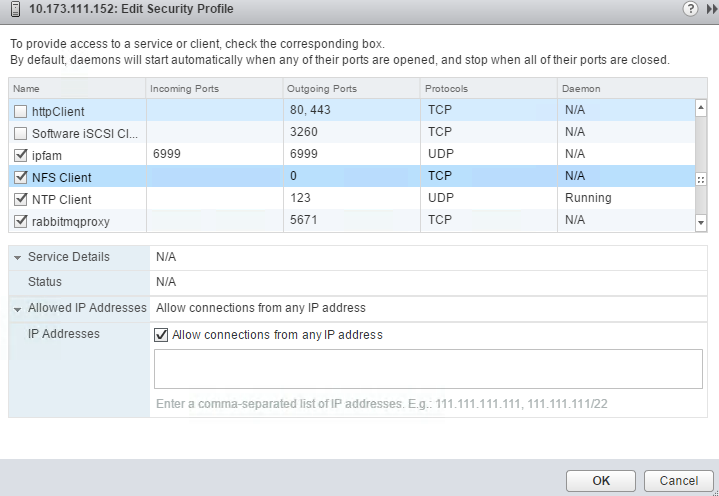

---

copyright:
  years: 2014, 2025
lastupdated: "2025-03-06"

keywords: Classic File Storage, provisioning File Storage for VMware, NFS, File Storage, vmware,

subcollection: FileStorage

content-type: tutorial
services:
account-plan: paid
completion-time: 1h

---
{{site.data.keyword.attribute-definition-list}}

# Provisioning {{site.data.keyword.filestorage_short}} for use as a VMware datastore
{: #architectureguide}
{: toc-content-type="tutorial"}
{: toc-services=""}
{: toc-completion-time="1h"}

This tutorial guides you through the steps of ordering and configuring {{site.data.keyword.filestorage_full}} in a vSphere environment at {{site.data.keyword.cloud}}. {{site.data.keyword.filestorage_short}} is designed to support high I/O applications that require predictable levels of performance. The predictable performance is achieved through the allocation of protocol-level input/output operations per second (IOPS) to individual volumes.
{: shortdesc}

If you require more than eight hosts to access your VMware&reg; datastore, then choosing NFS {{site.data.keyword.filestorage_short}} is the best practice.
{: tip}

The {{site.data.keyword.filestorage_short}} offering is accessed and mounted through an NFS connection. In a VMware&reg; deployment, a single volume can be mounted to up to 64 ESXi hosts as shared storage. You can also mount multiple volumes to create a storage cluster to use vSphere Storage Distributed Resource Scheduler (DRS).

You can also familiarize yourself with the [VMware vSphere 8.0 - NFS Datastore Concepts and Operations in vSphere Environment](https://techdocs.broadcom.com/us/en/vmware-cis/vsphere/vsphere/8-0/vsphere-storage-8-0/working-with-datastores-in-vsphere-storage-environment/nfs-datastore-concepts-and-operations-in-vsphere-environment.html){: external}.

## Before you begin
{: #NFSfile_as_datastore_req}

### Ordering considerations
{: #preorderconsiderationsvmware}

Pricing and configuration options for {{site.data.keyword.filestorage_short}} are charged based on a combination of the reserved space and the offered IOPS.

When you order {{site.data.keyword.filestorage_short}}, consider the following information:

- When you decide on the size, consider the size of the workload and the throughput needed. Size matters with the Endurance service, which scales performance linearly in relation to capacity (IOPS/GB). Conversely, the Performance service allows the administrator to choose capacity and performance independently. Throughput requirements matter with Performance.

   The throughput calculation is IOPS x 16 KB. IOPS is measured based on a 16-KB block size with a 50-50 read/write mix. Increasing block size increases the throughput but decreases IOPS. For example, doubling the block size to 32-KB blocks maintains the maximum throughput but halves the IOPS.
   {: note}

- NFS uses many extra file control operations such as `lookup`, `getattr`, and `readdir`. These operations in addition to read/write operations can count as IOPS and vary by operation type and NFS version.

- Both NFSv3 and NFSv4.1 are supported in the {{site.data.keyword.cloud}} environment. However, the use NFSv3 is preferred due to its different file locking mechanism. NFSv4.1 must quiesce all operations and then complete lock reclamation, thus protocol issues can occur during network events.

   You can't use different NFS versions to mount the same datastore on multiple hosts. Because NFS 3 and NFS 4.1 clients don't use the same locking protocol, accessing the same virtual disks from two incompatible clients might result in incorrect behavior and cause data corruption. For more information, see [NFS File Locking](https://techdocs.broadcom.com/us/en/vmware-cis/vsphere/vsphere/8-0/vsphere-storage-8-0/working-with-datastores-in-vsphere-storage-environment/nfs-datastore-concepts-and-operations-in-vsphere-environment/guidelines-and-requirements-for-nfs-storage-with-esxi/nfs-file-locking.html){: external}.
   {: important}

- {{site.data.keyword.filestorage_short}} volumes are accessible only to authorized devices, subnets, or IP addresses.

- To avoid storage disconnection during path-failover {{site.data.keyword.IBM}} recommends installing VMware&reg; tools, which set an appropriate timeout value. Don't change the value because the default setting is sufficient to make sure that your VMware&reg; host doesn't lose connectivity.

- {{site.data.keyword.filestorage_short}} allows administrators to set snapshot schedules that create and delete snapshot copies automatically for each storage volume. You can also create extra snapshot schedules (hourly, daily, weekly) for automatic snapshots and manually create ad hoc snapshots for business continuity and disaster recovery (BCDR) scenarios. Automatic alerts are delivered through the {{site.data.keyword.cloud}} console to the volume owner for the retained snapshots and space used. Snapshot space is required to use snapshots. Space can be purchased on the initial volume order or after the initial provisioning. Restoring the {{site.data.keyword.filestorage_short}} volume requires powering off all the VMs. The volume needs to be temporarily unmounted from the ESXi host to avoid any data corruption during the process. For more information, see the [snapshots](/docs/FileStorage?topic=FileStorage-snapshots) article.

   VMware&reg; environments are not aware of snapshots. The {{site.data.keyword.filestorage_short}} snapshot capability must not be confused with VMware&reg; snapshots. Any recovery that uses the {{site.data.keyword.filestorage_short}} snapshot feature must be handled from the [{{site.data.keyword.cloud}} console](/login){: external}.
   {: important}

### Ordering required resources
{: #orderauthvmware}

Review [Attached storage infrastructure design](/docs/vmwaresolutions?topic=vmwaresolutions-storage-infra-design) and follow the instructions in the [Advanced Single-Site VMware&reg; Reference Architecture](/docs/virtualization?topic=virtualization-advanced-single-site-vmware-reference-architecture){: external} to provision and configure your VMware environment.

{{site.data.keyword.filestorage_short}} can be ordered through [The {{site.data.keyword.cloud}} catalog](/catalog){: external}, from the [CLI](/docs/cli?topic=cli-sl-file-storage-service#sl_file_volume_order), with the API or Terraform. For more information, see [Ordering {{site.data.keyword.filestorage_short}}](/docs/FileStorage?topic=FileStorage-orderingFileStorage).

### Authorizing hosts 
{: #hostauthvmware}

You can create the authorization in the [UI](/docs/FileStorage?topic=FileStorage-managingstorage&interface=ui#authhostUI), from the [CLI](/docs/FileStorage?topic=FileStorage-managingstorage&interface=cli#authhostCLI), with the API, or with [Terraform](/docs/FileStorage?topic=FileStorage-managingstorage&interface=terraform#authhostterraform).

## Configuring the VMware virtual machine host
{: #configurevmwarehost}

Before you begin the configuration process, make sure that the following requirements are met:

- {{site.data.keyword.BluBareMetServers}} with VMware&reg; ESXi are provisioned with proper storage configuration and ESXi login credentials.
- {{site.data.keyword.cloud}} Windows physical or {{site.data.keyword.virtualmachinesshort}} is available in the same data center as the {{site.data.keyword.BluBareMetServers}}. Make sure that you know the public IP address of the {{site.data.keyword.cloud}} Windows server and the login credentials.
- You have a computer with internet access, and with the web browser software and a Remote Desktop Protocol (RDP) client installed.

### Connecting to vCenter
{: #connectvCenter}

1. From an internet-connected computer, start an RDP client and establish an RDP session to the {{site.data.keyword.BluVirtServers_full}} that is provisioned in the same data center where vSphere vCenter is installed.
2. From the {{site.data.keyword.BluVirtServers_short}}, start a web browser and connect to VMware&reg; vCenter through the vSphere Web Client.

### Confirming the firewall settings
{: #configurevmwarehost1}

To enable access to NFS storage, ESXi automatically opens firewall ports for the NFS clients when you mount an NFS datastore. For troubleshooting reasons, you might need to verify that the ports are open.
1. In the vSphere Client, select the ESXi host.
1. Go to **Manage > Settings > Security Profile** and click **Edit**.
1. Scroll down to an appropriate version of NFS to make sure that the port is open.
    {: caption="NFS Port information - Allow connection from any IP address." caption-side="bottom"}

For more information, see the [VMware vSphere 8.0 - Configuring ESXi Firewall](https://techdocs.broadcom.com/us/en/vmware-cis/vsphere/vsphere/8-0/vsphere-security-8-0/securing-esxi-hosts/customizing-hosts-with-the-security-profile/esxi-firewall-configuration.html){: external} and [VMware vSphere 8.0 - NFS Client Firewall Behavior](https://techdocs.broadcom.com/us/en/vmware-cis/vsphere/vsphere/8-0/vsphere-storage-8-0/working-with-datastores-in-vsphere-storage-environment/nfs-datastore-concepts-and-operations-in-vsphere-environment/guidelines-and-requirements-for-nfs-storage-with-esxi/firewall-configuration-for-nfs-storage-with-esxi.html#GUID-70686ADB-961A-46BD-B814-48DCF6C5E34B-en){: external}.

### Configuring Jumbo frame settings
{: #configureJumboFrames}

1. Configure Jumbo Frames by going to the **ESXi host Manage** tab, select **Manage** and then **Networking**.
1. Select the **VMkernel adapters**, highlight the **vSwitch** and the click **Edit** (Pencil icon).
1. Select the **NIC setting**, and make sure that the NIC MTU is set to 9000.
1. **Optional**. Validate the jumbo frame settings.
   - Windows
     ```shell
     ping -f -l 8972 a.b.c.d
     ```
     {: pre}

   - UNIX
     ```sh
     ping -s 8972 a.b.c.d
     ```
     {: pre}

     The value a.b.c.d is the neighboring {{site.data.keyword.BluVirtServers_short}} interface.

     Example
     ```text
     ping a.b.c.d (a.b.c.d) 8972(9000) bytes of data.
     8980 bytes from a.b.c.d: icmp_seq=1 ttl=128 time=3.36 ms
     ```

For more information, see [VMware vSphere 8.0 - Enabling Jumbo Frames](https://techdocs.broadcom.com/us/en/vmware-cis/vsphere/vsphere/8-0/vsphere-networking-8-0/managing-network-resources/enabling-jumbo-frames.html){: external}.

### Adding an uplink adapter to a virtual switch
{: #configurevmwarehost2}

1. In the vSphere Client, go to the host.
1. On the **Configure** tab, expand **Networking**, and select **Virtual switches**.
1. Select the virtual switch that you want to add a physical adapter to.
1. Click **Manage physical adapters**.
1. Add one or more available physical network adapters to the switch.
1. Click **Add adapters**, select one or more network adapters from the list and click **OK**.
1. The selected adapters appear in the failover group list under the **Assigned adapters** list.
1. Use the up and down arrows to change the position of an adapter in the failover groups. The failover group determines the role of the adapter for exchanging data with the external network, that is, active, standby or unused. By default, the adapters are added as active to the standard switch.
   {: caption="Add the physical adapters to the switch." caption-side="bottom"}
1. Click **OK** to apply the physical adapter configuration.
1. Return to **Virtual switches**, and click **Edit setting**.
1. Expand **NIC teaming**.
1. Verify that the **Load-balancing** option is set to **Route based on the originating virtual port** and click **OK**.

For more information, see [vSphere Distributed Switch](/docs/vmwaresolutions?topic=vmwaresolutions-storage-infra-mgmt#storage-infra-mgmt-vsphere-ds), and [VMware vSphere 8.0 - Edit Virtual Switch Settings in theVMware Host Client](https://techdocs.broadcom.com/us/en/vmware-cis/vsphere/vsphere/8-0/edit-virtual-switch-settings-in-the-vsphere-host-client.html){: external}.

### Configuring static routing (Optional)
{: #configurevmwarehost3}

If you have a VMkernel port group for NFS storage, extra steps must be taken. By default, ESXi uses the VMkernel port that is on the same subnet as an NFS volume to mount the NFS volume. Since layer 3 routing is used to mount the NFS volume, ESXi must be forced to use the VMkernel port that was configured to mount the NFS volume. To use the correct port, a static route must be created to the storage array.

For more information, see [vSphere host static routing](/docs/vmwaresolutions?topic=vmwaresolutions-storage-infra-mgmt#storage-infra-mgmt-vsphere-routing), and [VMware vSphere 8.0 - Configure VMkernel Binding for NFS 3 Datastores](https://techdocs.broadcom.com/us/en/vmware-cis/vsphere/vsphere/8-0/vsphere-storage-8-0/working-with-datastores-in-vsphere-storage-environment/nfs-datastore-concepts-and-operations-in-vsphere-environment/configuring-the-nfs-datastore.html){: external}.

To configure a static route, SSH to each ESXi host that uses Performance or Endurance storage and run the following commands. Take note of the IP address that is the result of the `ping` command and use it with the `esxcli  network` command.

```sh
ping <hostname of the storage array>
```
{: pre}

The NFS storage DNS hostname is a Forwarding Zone (FZ) that has multiple IP addresses assigned to it. These IP addresses are static and belong to that specific DNS hostname. Any of those IP addresses can be used to access a specific volume.
{: note}

```sh
esxcli network ip route ipv4 add –gateway GATEWAYIP –network <result of ping command>/32
```
{: pre}

The same IP address as it can be used for mounting the volume in the next step. This process needs to be done for each NFS share you plan to mount to your ESXi host. For more information, see the VMware&reg; KB article, [Configuring static routes for VMkernel ports on an ESXi host](https://knowledge.broadcom.com/external/article?legacyId=2001426){: external}.

### Configuring Advanced ESXi host-side settings
{: #configureESXihost}

Configure the Advanced settings that are required for ESXi hosts that want to mount NFS storage. 

1. Review the table of [Advanced configuration parameters](/docs/vmwaresolutions?topic=vmwaresolutions-storage-settings#storage-settings-adv-config-param).
2. Follow the steps to configure these advance settings in the vSphere Client or from the vSphere PowerCLI as they are described in Broadcom's [Configuring advanced options for ESXi](https://knowledge.broadcom.com/external/article/310338/configuring-advanced-options-for-esxi.html){: external}.

## Creating the VMware&reg; datastore
{: #mountNFSonESXI}

{{site.data.keyword.cloud_notm}} recommends that FQDN names be used to connect to the VMware&reg; datastore. Using direct IP addressing might bypass the load-balancing mechanism that is provided by using FQDN.

If you want to use the IP address instead of the FQDN, ping the server to obtain the IP address.
```sh
ping <hostname of the storage array>
```
{: pre}

To obtain the IP address from an ESXi host, use `vmkping` as shown in the following example.

```text
~ # vmkping nfsdal0902a-fz.service.softlayer.com
PING nfsdal0902a-fz.service.softlayer.com (10.2.125.80): 56 data bytes
64 bytes from 10.2.125.80: icmp_seq=0 ttl=253 time=0.187 ms
```
{: screen}

### Creating the NFS datastore
{: #prereq-createNFSdatastore}

1. Click the **Go to vCenter** icon, and then **Hosts and Clusters**.
2. On the **Related Object** tab, click **Datastores**.
3. Click the **Create a new datastore** icon.
4. On the **New Datastore** screen, select the location of the VMware&reg; datastore and click **Next**.
5. On the **Type** screen, select **NFS**, and click **next**.
6. Then, select the NFS version. Both NFSv3 and NFSv4.1 are supported, but NFSv3 is preferred.

   Make sure that you use only one NFS version to access the datastore. Consequences of mounting one or more hosts to the same datastore by using different versions can result in data corruption.
   {: important}

7. On the **Name and configuration** screen, enter the name that you want to call the VMware datastore. Additionally, enter the hostname of the NFS server. Using the FQDN for the NFS server produces the best traffic distribution to the underlying server. IP address is also valid but is used less frequently and only in specific instances. Enter the folder name in the form of `/foldername`.
8. On the **Host accessibility** screen, select one or more hosts that you want to mount the NFS VMware&reg; datastore on and click **next**.
9. Review the inputs on the next screen and click **Finish**.
10. Repeat for any additional {{site.data.keyword.filestorage_short}} volumes.

For more information, see [VMware vSphere 8.0 - Creating a Datastore Cluster in vSphere](https://techdocs.broadcom.com/us/en/vmware-cis/vsphere/vsphere/8-0/vsphere-resource-management-8-0/creating-a-datastore-cluster.html){: external} and [VMware vSphere 8.0 - Creating vSphere Datastores](https://techdocs.broadcom.com/us/en/vmware-cis/vsphere/vsphere/8-0/vsphere-storage-8-0/working-with-datastores-in-vsphere-storage-environment/creating-vsphere-datastores.html){: external}.

## Enabling ESXi Storage I/O Control (Optional)
{: #enableSIOC}

Storage I/O Control (SIOC) is a feature available for customers who use an Enterprise Plus license. When SIOC is enabled in the environment, it changes the device queue length for the single VM. The change to the device queue length reduces the storage array queue for all VMs to an equal share. SIOC engages only if resources are constrained and the storage I/O latency is over a defined threshold.

In order for SIOC to determine when a storage device is congested or constrained, it requires a defined threshold. The congestion threshold latency is different for different storage types. The default selection is to 90% of peak throughput. The percentage of peak throughput value indicates the estimated latency threshold when the VMware&reg; datastore is using that percentage of its estimated peak throughput.

Incorrectly configuring SIOC for a VMware&reg; datastore or for a VMDK can significantly impact performance.
{: important}

For more information, see [Attached storage infrastructure design](/docs/vmwaresolutions?topic=vmwaresolutions-storage-infra-design) and [Configuration and settings for attached storage](/docs/vmwaresolutions?topic=vmwaresolutions-storage-settings){: external}.

### Configuring Storage I/O Control for a VMware datastore
{: #configureSIOCStorage}
{: step}

1. Browse to the VMware&reg; datastore in the vSphere Web Client navigator.
2. Click the **Manage** tab.
3. Click **Settings** and click **General**.
4. Click **Edit** for **Datastore Capabilities**.
5. Select the **Enable Storage I/O Control** checkbox.
    {: caption="Select Enable Storage I/O Control." caption-side="bottom"}
6. Click **OK**.

For more information about how to Enable Storage I/O Control, see [VMware vSphere 8.0 - Manage Storage I/O Resources with vSphere](https://techdocs.broadcom.com/us/en/vmware-cis/vsphere/vsphere/8-0/vsphere-resource-management-8-0/managing-storage-i-o-resources.html){: external}.

This setting is specific to the VMware&reg; datastore and not to the host.
{: note}

### Configuring Storage I/O Control for {{site.data.keyword.BluVirtServers_short}}
{: #configureSIOCStoragehost}

You can limit individual virtual disks for individual VMs or grant them different shares with SIOC. By limiting disks and granting different shares, you can match and align the environment to the workload with the acquired {{site.data.keyword.filestorage_full}} volume IOPS number. The limit is set by IOPS and it is possible to set a different weight or shares.

Virtual disks shares that are set to **High** (2,000 shares) receive twice as much I/O as a disk set to **Normal** (1,000 shares). Virtual disks shares that are set to **High** (2,000 shares) receive four times as much I/O as a share that is set to **Low** (500 shares). Normal is the default value for all the VMs, so you need to adjust the **Normal** settings for the VMs that require it.

For more information, see [Storage I/O Control for NFS v3](/docs/vmwaresolutions?topic=vmwaresolutions-storage-settings#storage-settings-io-control-nfs-v3).

1. Browse to the virtual machine in the vSphere Client.
   1. To find a virtual machine, select a data center, folder, cluster, resource pool, or host.
   1. Click the **VMs** tab.
1. Right-click the virtual machine and click **Edit Settings**.
1. Click the **Virtual Hardware** tab and select a virtual hard disk from the list. Expand **Hard disk.**
1. Select a VM storage policy from the menu. If you select a storage policy, do not manually configure Shares and Limit - IOPS.
1. Under **Shares**, click the menu and select the relative number of shares to allocate to the virtual machine (Low, Normal, or High). You can select Custom to enter a user-defined shares value.
1. Under **Limit - IOPS**, click the drop-down menu and enter the maximum limit of storage resources to allocate to the virtual machine. By default, IOPS is unlimited. 
1. Click **OK**.

For more information about how to Set Storage I/O Control Resource Shares and Limits, see [VMware vSphere 8.0 - Manage Storage I/O Resources with vSphere](https://techdocs.broadcom.com/us/en/vmware-cis/vsphere/vsphere/8-0/vsphere-resource-management-8-0/managing-storage-i-o-resources.html){: external}.

This process is used to set the resource consumption limits of individual vDisks in a {{site.data.keyword.BluVirtServers_short}} even when SIOC is not enabled. These settings are specific to the individual guest, and not the host, although they are used by SIOC.
{: important}
